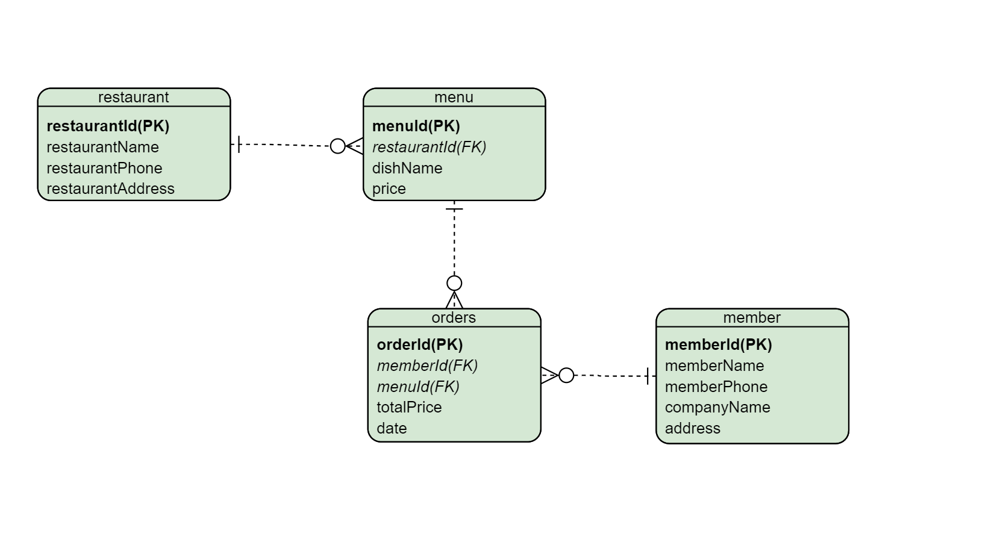

# HW_W2
題目 : 訂便當系統

# 繳交檔案
bendon.txt

# 規劃
- database : dibendon
- table1 : member - memberId(PK), memberName, memberPhone, companyName, address
- table2 : restaurant - restaurantId(PK), restaurantName, restaurantPhone, restaurantAddress
- table3 : menu - menuId(PK), restaurantId(FK), dishName, price
- table4 : orders - orderId(PK), memberId(FK), menuId(FK), totalPrice, date

